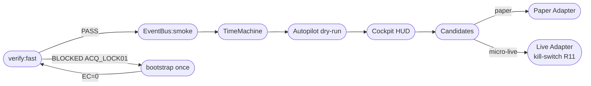
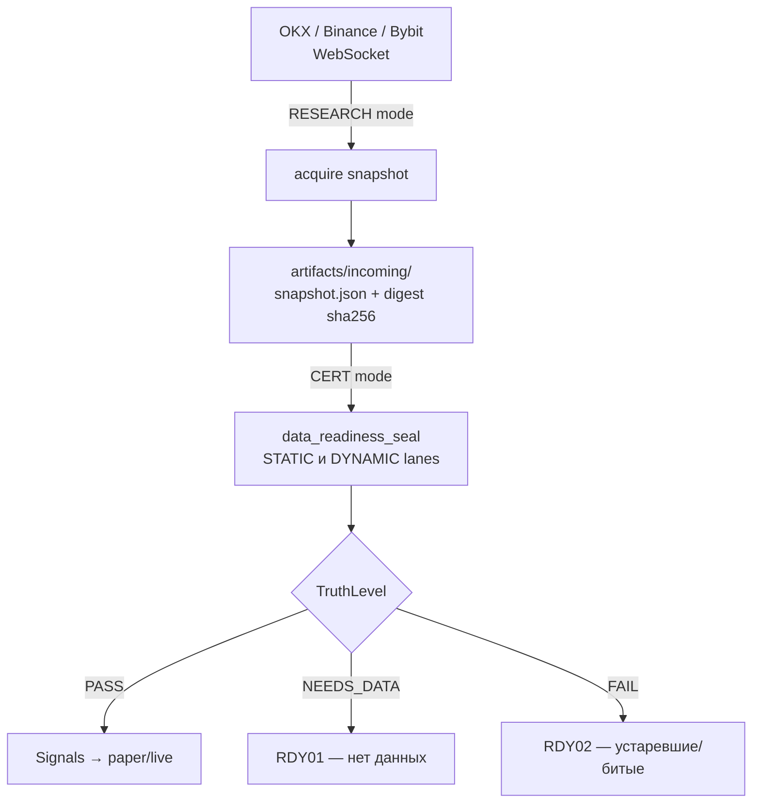
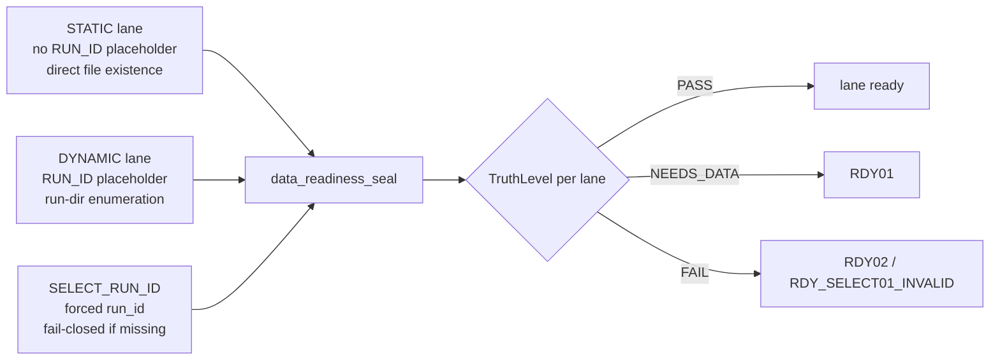

# TREASURE ENGINE

> **Автономный торговый организм. Deterministic. Offline-first. Fail-closed.**

---

## БЫСТРЫЙ СТАРТ

```bash
# Один раз в чистой среде (нужна сеть):
npm run -s ops:node:toolchain:bootstrap

# Каждый день:
npm run -s verify:fast
npm run -s ops:life
```

**ONE_NEXT_ACTION: `npm run -s ops:life`**

---

## Что происходит внутри



---

## Режимы

| Режим | Описание |
|-------|----------|
| **CERT** | Offline-only. Строгий write-scope. Все gate-прогоны. |
| **CLOSE** | Подмножество CERT. Быстрое закрытие эпохи. |
| **AUDIT** | Только SSOT-документы. Нет runtime. |
| **RESEARCH** | Интернет через двойной ключ. Нет CERT. |

---

## Двойной ключ (сеть)

Сеть в CERT **запрещена**. Для операций с сетью нужны **оба** условия:

1. Флаг `--enable-network` передан команде
2. Файл `artifacts/incoming/ALLOW_NETWORK` с текстом: `ALLOW_NETWORK: YES`

```bash
npm run -s ops:net:unlock          # создаёт файл
# ... команда с --enable-network
npm run -s ops:net:lock            # удаляет файл (всегда!)
```

`ops:node:toolchain:bootstrap` делает все три шага за один вызов.

---

## Safety contracts

| Правило | Суть |
|---------|------|
| **R3** | CERT lanes offline-only; сеть → `NETV01` |
| **R6** | Node SSOT 22.22.0; лестница HOST→DOCKER→VENDORED |
| **R9** | Каждый фикс — с regression gate + evidence |
| **R11** | Прибыль must-fail по умолчанию; live unlock только через file contract |
| **R14** | Apply actions — двойной ключ (flag + token file) |

---

## Reason Codes

```
ACQ_LOCK01    — toolchain lock отсутствует / невалиден
NT02          — node binary отсутствует / не исполняемый / не та версия
NETV01        — попытка сети в CERT (запрещено, fail-closed)
RDY01         — данные отсутствуют (lane NEEDS_DATA)
RDY_SELECT01_INVALID — SELECT_RUN_ID указан, директория не найдена
```

Все токены: `specs/reason_code_taxonomy.json` (SSOT).
`reason_code` — всегда `^[A-Z0-9_]+$`, human-readable текст — только в `detail.message`.

---

## Data Organ

Слой между биржей и сигналами.



Lane registry: `specs/data_lanes.json`
Capabilities: `specs/data_capabilities.json` (с `_field_meta` для каждого числового поля)

---

## Readiness Lane Registry



---

## Диаграммы

| Диаграмма | Путь |
|-----------|------|
| Operator loop | `docs/assets/treasure_organism.svg` |
| Data Organ pipeline | `docs/assets/data_organ_flow.svg` |
| R2 OKX proof | `docs/assets/r2_okx_orderbook_proof.svg` |

---

## Регрессионные гейты (R1.2)

| Gate ID | Что проверяет |
|---------|---------------|
| `RG_REASON01_TOKEN_PURITY` | reason_code — только токен `^[A-Z0-9_]+$` |
| `RG_REASON02_IN_TAXONOMY` | все токены из taxonomy SSOT |
| `RG_TOOLCHAIN_REASON01` | ACQ_LOCK01/NT02 классификация toolchain |
| `RG_TOOLCHAIN_REASON02` | structured `detail` объект с next_action |
| `RG_NET_UNLOCK01` | unlock/lock source contracts |
| `RG_NET_UNLOCK02` | lock убирает ALLOW_NETWORK; bootstrap always locks |
| `RG_NET_UNLOCK03` | CERT отказывает при наличии ALLOW_NETWORK |
| `RG_DATA_R3_ACQUIRE_CONTRACT` | предполётный гейт EPOCH-67 OKX orderbook |

---

## Операторские команды

```bash
# Полный цикл жизни
npm run -s ops:life

# Только быстрая проверка
npm run -s verify:fast

# Обзор состояния
npm run -s ops:cockpit

# TimeMachine heartbeat
npm run -s ops:timemachine

# Разблокировка если застряли
npm run -s epoch:victory:triage

# Autopilot (dry-run)
npm run -s ops:autopilot

# Autopilot (apply, требует двойной ключ)
npm run -s ops:autopilot -- --apply
```

---

## Как контрибьютить (Clean-Room PR)

1. **Ветка** от `origin/main`: `git checkout -b claude/feat-<desc>-<session-id> origin/main`
2. **Только allowlist**: `scripts/**`, `specs/**`, `docs/**` (если необходимо)
3. **Нет evidence bloat**: не включать `reports/evidence/EPOCH-*` в diff
4. **PR01 guard**: `npm run -s verify:regression:pr01-evidence-bloat-guard` (лимит 60 файлов)
5. **Каждый фикс** — regression gate + evidence (правило R9)
6. **verify:fast x2**: должен быть детерминированным (PASS или честный BLOCKED ACQ_LOCK01)

---

## Структура директорий

```
scripts/
  ops/          — операционные скрипты (cockpit, timemachine, bootstrap...)
  verify/       — gate-скрипты (regression_*.mjs)
  gov/          — governance (reason_code_audit, ...)
  edge/         — data organ, adapters, signals
specs/
  reason_code_taxonomy.json  — SSOT всех reason_code
  data_capabilities.json     — capabilities с _field_meta
  data_lanes.json            — реестр полос данных
  epochs/                    — спеки эпох (EPOCH-01..EPOCH-67)
docs/
  AGENTS.md (root)           — главный SSOT для AI
  AI_RUNBOOK.md              — детальный runbook
  DATA_DELIVERY_SEMANTICS.md — delivery model SSOT
  TRUST_SCORE_DOCTRINE.md    — TruthLevel vs trust_score
  ARCHITECTURE_OVERVIEW_RU.md
  DATA_ORGAN_PRODUCT_RU.md
  OKX_ORDERBOOK_DIGEST_SPEC.md
  OKX_ORDERBOOK_R2_PROCEDURE.md
artifacts/
  incoming/      — operator input files (SELECT_RUN_ID, ALLOW_NETWORK, ...)
  toolchains/    — vendored node binary (gitignored binary, lock tracked)
reports/
  evidence/
    EXECUTOR/    — AUDIT-only SSOT gate receipts
    EPOCH-*/     — runtime evidence (gitignored transient)
```

---

## Следующие шаги: EPOCH-67 DATA R3

```bash
# Bootstrap (один раз)
npm run -s ops:node:toolchain:bootstrap

# Предполётный гейт
npm run -s verify:regression:rg-data-r3-acquire-contract

# После успешного acquire → EPOCH-68 PROFIT P2
# signals → paper → micro-live → kill-switch (R11)
```

---

*Treasure Engine — потому что рынок не прощает лжи.*
