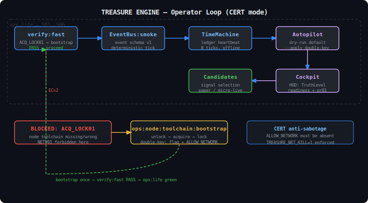

# АРХИТЕКТУРА TREASURE ENGINE — Обзор организма

> SSOT: `AGENTS.md` → `docs/AI_RUNBOOK.md`
> Эта страница: быстрый старт в архитектуру для новых контрибьюторов.

---

## Метафора: «Живой организм»

Treasure Engine — это **автономный торговый организм**, а не набор скриптов.
У него есть:

| Орган | Роль |
|-------|------|
| **EventBus** | Нервная система — маршрутизация событий между органами |
| **TimeMachine** | Хронограф — детерминированный тик-леджер; heartbeat |
| **Autopilot** | Мозг принятия решений — dry-run по умолчанию, apply через двойной ключ |
| **Data Organ** | Пищеварение — acquire → replay → seal; STATIC и DYNAMIC lanes |
| **Cockpit** | Зрение оператора — HUD с TruthLevel, readiness, pr01 |
| **Candidates** | Воля к действию — сигналы → paper → micro-live → kill-switch |

---

## Диаграмма потока оператора



---

## Режимы работы

```
CERT      — offline-only. Строгий write-scope. Все gate-прогоны.
CLOSE     — подмножество CERT. Быстрое закрытие эпохи.
AUDIT     — только SSOT-документы (EXECUTOR/docs). Нет runtime-снапшотов.
RESEARCH  — интернет через двойной ключ. Нет CERT-скриптов.
ACCEL     — скоростные эксперименты; никогда не авторитативны.
```

---

## Закон инициализации

```
npm run -s ops:node:toolchain:bootstrap   # один раз в чистой среде
npm run -s verify:fast                    # каждый день в начале
npm run -s ops:life                       # полный цикл жизни
```

Если `verify:fast` возвращает `BLOCKED ACQ_LOCK01` — toolchain отсутствует. Это **норма** до
bootstrap. Если появляется `NETV01` — это баг (NETV01 зарезервирован ИСКЛЮЧИТЕЛЬНО
для попытки сетевых операций в CERT-режиме).

---

## SSOT иерархия документов

```
AGENTS.md               ← главный SSOT для AI-агентов
CLAUDE.md               ← exec-summary + ссылка на AGENTS.md
docs/AI_RUNBOOK.md      ← детальный operational runbook
docs/AI_TEMPLATES/      ← шаблоны отчётов и evidence
specs/reason_code_taxonomy.json  ← SSOT всех reason_code токенов
```

---

## Сетевой двойной ключ

Сеть в CERT-режиме запрещена абсолютно. Для bootstrap нужны **два ключа одновременно**:

1. Флаг `--enable-network` передан команде
2. Файл `artifacts/incoming/ALLOW_NETWORK` с содержимым: `ALLOW_NETWORK: YES`

Если один ключ отсутствует — команда BLOCKED с `ACQ_NET01`.
`ops:node:toolchain:bootstrap` создаёт и убирает файл автоматически.

---

## Детерминизм x2

Каждый gate запускается дважды подряд. Оба прогона должны вернуть одинаковый
exit code и `reason_code`. Любое расхождение — баг.

```bash
npm run -s verify:fast  # прогон 1
npm run -s verify:fast  # прогон 2 — должен совпасть
```
