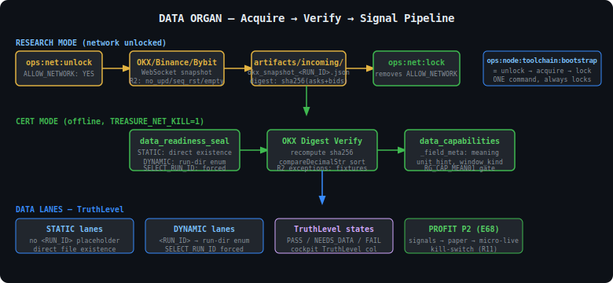
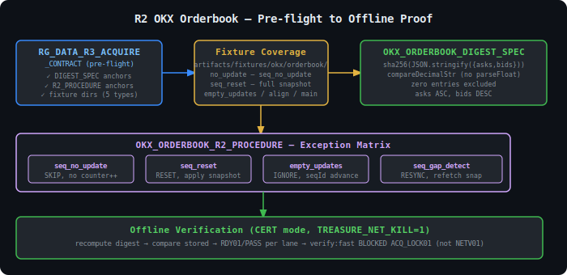

# DATA ORGAN — Продуктовое описание (RU)

> Связанные SSOT: `docs/DATA_DELIVERY_SEMANTICS.md`, `docs/TRUST_SCORE_DOCTRINE.md`,
> `specs/data_capabilities.json`, `specs/data_lanes.json`

---

## Что это такое

Data Organ — это слой между биржей и сигналами. Он принимает «грязные» данные
с WebSocket, проверяет их оффлайн, применяет R2-процедуры исключений,
вычисляет канонический дайджест и выставляет оценку готовности (`TruthLevel`)
по каждой полосе данных (lane).

---

## Диаграмма потока



---

## Delivery Semantics (краткое)

| Концепция | Значение |
|-----------|----------|
| **STATIC lane** | Пути без `<RUN_ID>` — прямая проверка существования файла |
| **DYNAMIC lane** | Пути с `<RUN_ID>` — перебор директорий прогонов |
| **SELECT_RUN_ID** | Файл `artifacts/incoming/SELECT_RUN_ID` — принудительный выбор run_id |
| **TruthLevel** | PASS / NEEDS_DATA / FAIL по каждой полосе |
| **trust_score** | НЕ реализован (R2). Не fabricate. |

Полный документ: `docs/DATA_DELIVERY_SEMANTICS.md`

---

## Capabilities (`specs/data_capabilities.json`)

Для каждого числового поля в зонах `rate_limits` и `orderbook` у каждого провайдера
(binance / bybit / okx) есть объект `_field_meta`:

```json
"connections_per_ip": 300,
"_field_meta": {
  "connections_per_ip": {
    "meaning": "Max simultaneous WebSocket connections per IP address",
    "unit_hint": "count",
    "window_kind": "static_limit"
  }
}
```

Гейт `RG_CAP_MEAN01` проверяет, что у каждого числового поля есть `_field_meta`.

---

## R2 OKX Orderbook — предполётная проверка



Полный SSOT: `docs/OKX_ORDERBOOK_DIGEST_SPEC.md` + `docs/OKX_ORDERBOOK_R2_PROCEDURE.md`

Предполётный гейт `RG_DATA_R3_ACQUIRE_CONTRACT` проверяет оффлайн (без сети):
- Наличие якорей DIGEST_SPEC (sha256, canonicalize, compareDecimalStr)
- Наличие якорей R2_PROCEDURE (no-update, seq-reset, empty-updates)
- Наличие fixture-директорий для всех R2-исключений
- Корректность wiring bootstrap → acquire (--enable-network передан)
- Двойной ключ в acquire (flag + ALLOW_NETWORK)
- Отсутствие ALLOW_NETWORK (CERT clean state)

---

## Readiness States

| Код | Значение |
|-----|----------|
| `RDY01` | Файл/директория отсутствует |
| `RDY02` | Данные устарели / структура неверна |
| `RDY_SELECT01_INVALID` | SELECT_RUN_ID указан, но директория не найдена |
| `NONE` | PASS (данные присутствуют и валидны) |

---

## Следующий шаг: EPOCH-67 DATA R3

```bash
# 1. Bootstrap toolchain (один раз, требует сети)
npm run -s ops:node:toolchain:bootstrap

# 2. Проверить состояние
npm run -s ops:node:toolchain:ensure

# 3. Acquire OKX snapshot (RESEARCH mode, двойной ключ)
npm run -s ops:net:unlock
node scripts/ops/okx_orderbook_acquire.mjs --enable-network
npm run -s ops:net:lock

# 4. Оффлайн верификация
npm run -s verify:regression:rg-data-r3-acquire-contract
```
