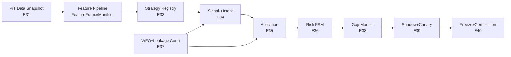
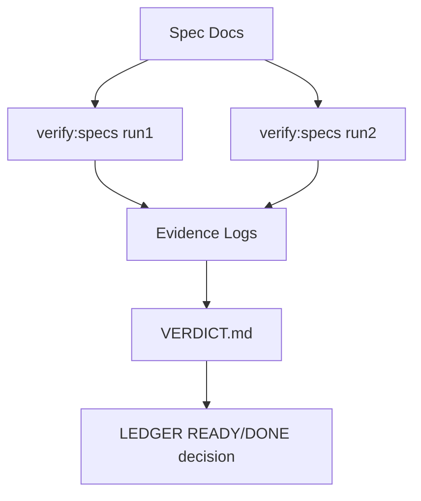

# SDD — EDGE Epochs 31→40

## Operator Summary
- This SDD is the single architecture blueprint for EDGE epochs E31..E40.
- Scope is specification only: no runtime trading implementation in this cycle.
- Offline-first is mandatory; network paths require `ENABLE_NETWORK_TESTS=1`.
- Determinism is mandatory: same inputs + seed + config = same fingerprint.
- Point-in-time data discipline is mandatory: no future leakage.
- Shadow/canary must remain no-order by default.
- Every epoch defines explicit contracts, invariants, and fail-fast stop rules.
- Every gate must produce evidence artifacts under `reports/evidence/<EVIDENCE_EPOCH>/`.
- READY in ledger means implementation-ready spec, not runtime completed.
- E40 release freeze requires clean-clone reproducibility and certification report.

## Where to look next
- Per-epoch implementation contracts: `specs/epochs/EPOCH-31.md` ... `EPOCH-40.md`.
- Research basis and scoring: `docs/EDGE_RESEARCH/SOURCES.md` and `DECISION_MATRIX.md`.
- AI governance and honesty proofs: `docs/EDGE_RESEARCH/AI_MODULE.md`.

## Canonical Glossary (Consistency Sweep)
- **FeatureFrame**: point-in-time feature row keyed by symbol/timestamp and provenance.
- **StrategyManifest**: immutable semver contract for a strategy artifact.
- **Signal**: strategy output hypothesis with confidence and reasons.
- **Intent**: constrained executable instruction derived from signal.
- **Order**: exchange-facing object (forbidden in shadow mode by default).
- **Fill**: simulated or live execution result with price/size/latency/fees.
- **SimReport**: deterministic simulator assumptions and output fingerprint.
- **RiskState**: FSM mode and active triggers/cooldowns.
- **GapScore**: scalar drift score between simulation and shadow/live observations.
- **CanaryPhase**: staged allocation ramp (5→15→35→70→100) with rollback gates.
- **Fingerprint**: sha256 hash over canonicalized payload and declared input set.
- **EvidencePack**: complete logs/manifests/verdict for a run.
- **Manifest**: immutable metadata file chaining hashes and schema versions.

## SSOT linkage (authoritative)
- Terminology SSOT: `docs/EDGE_RESEARCH/GLOSSARY.md`.
- Determinism SSOT: `docs/EDGE_RESEARCH/DETERMINISM_POLICY.md`.
- Contract SSOT: `docs/EDGE_RESEARCH/CONTRACTS_CATALOG.md`.

## Canonical term mapping for this SDD
- `StrategyManifest` in legacy sections maps to canonical `StrategySpec`.
- `PortfolioState` in legacy sections maps to canonical `AllocationPlan` output state.
- `RiskState` in legacy sections maps to canonical `RiskDecision` state transition record.
- `GapReport` maps to canonical `RealityGapReport`.
- `ShadowRunRecord` maps to canonical `ShadowEvent`.
- `CanaryPhase` maps to canonical `CanaryPhaseState`.

## Module Boundaries
1. **Data Plane (E31)**: point-in-time market snapshots and deterministic feature pipeline.
2. **Simulation Plane (E32)**: deterministic microstructure simulator (slippage, latency, fee, partial fills).
3. **Strategy Product Plane (E33)**: immutable strategy registry and compatibility checks.
4. **Decision Plane (E34–E35)**: signal-to-intent transformation and portfolio allocation.
5. **Safety Plane (E36, E38, E39)**: risk FSM, auto-brake, shadow guards, canary governor.
6. **Validation Plane (E37, E40)**: overfit court, leakage sentinel v2, certification freeze.

## Global Invariants
- Offline-first default; no hidden network dependencies.
- No look-ahead leakage in features or labels.
- No NaN/Inf, negative prices, negative fees, or non-monotonic timestamps.
- All numeric rounding follows deterministic policy: price to 1e-8, size to 1e-8, bps to 1e-4.
- Hash policy is canonical JSON (`UTF-8`, sorted keys, stable arrays, fixed decimal serialization).
- Evidence completeness is required before status claims.
- Live order placement is disabled by default; shadow emits intents only.

## Contract Catalog (Schema Blueprint)
All contracts include: `schema_version`, `deterministic_fingerprint`, `forbidden_values`.

### FeatureFrame
Required fields: `schema_version`, `symbol`, `ts_event`, `ts_feature`, `bar_interval`, `features`, `feature_vector_order`, `source_snapshot_id`, `provenance`, `deterministic_fingerprint`, `forbidden_values`.

### FeatureManifest
Required fields: `schema_version`, `snapshot_id`, `dataset_hash_sha256`, `feature_hash_sha256`, `config_hash_sha256`, `seed`, `extraction_params`, `row_count`, `ts_min`, `ts_max`, `deterministic_fingerprint`, `forbidden_values`.

### StrategyManifest
Required fields: `schema_version`, `strategy_id`, `name`, `semver`, `engine_api_version`, `params_schema`, `default_params`, `compatibility`, `deterministic_settings`, `artifact_hashes`, `deterministic_fingerprint`, `forbidden_values`.

### Signal
Required fields: `schema_version`, `signal_id`, `strategy_id`, `symbol`, `timestamp`, `side_hint`, `strength`, `confidence`, `reasons`, `feature_manifest_ref`, `deterministic_fingerprint`, `forbidden_values`.

### Intent
Required fields: `schema_version`, `intent_id`, `signal_id`, `symbol`, `timestamp`, `side`, `size_units`, `limit_price`, `time_in_force`, `max_slippage_bps`, `risk_tags`, `constraints_applied`, `deterministic_fingerprint`, `forbidden_values`.

### PortfolioState
Required fields: `schema_version`, `timestamp`, `equity`, `cash`, `gross_exposure`, `net_exposure`, `leverage`, `positions`, `asset_caps`, `turnover_1d`, `drawdown`, `deterministic_fingerprint`, `forbidden_values`.

### RiskState
Required fields: `schema_version`, `timestamp`, `mode`, `active_triggers`, `cooldown_until`, `kill_switches`, `manual_override`, `deterministic_fingerprint`, `forbidden_values`.

### SimReport
Required fields: `schema_version`, `sim_run_id`, `slippage_model`, `fee_model`, `latency_model`, `partial_fill_assumptions`, `inputs_fingerprint`, `output_metrics`, `calibration_refs`, `deterministic_fingerprint`, `forbidden_values`.

### WFOReport
Required fields: `schema_version`, `run_id`, `windows`, `purge_bars`, `embargo_bars`, `selection_criteria`, `is_metrics`, `oos_metrics`, `seed_dispersion`, `deterministic_fingerprint`, `forbidden_values`.

### GapReport
Required fields: `schema_version`, `timestamp`, `sim_ref`, `shadow_ref`, `delta_slippage_bps`, `delta_fill_rate`, `delta_latency_ms`, `delta_reject_rate`, `delta_pnl`, `gap_score`, `brake_action`, `deterministic_fingerprint`, `forbidden_values`.

### ShadowRunRecord
Required fields: `schema_version`, `run_id`, `timestamp`, `intents_emitted`, `orders_submitted`, `order_adapter_state`, `guards`, `deterministic_fingerprint`, `forbidden_values`.

### CertificationReport
Required fields: `schema_version`, `release_id`, `epoch_gate_results`, `ledger_snapshot_hash`, `spec_hash`, `evidence_hash`, `clean_clone_repro_refs`, `approvals`, `deterministic_fingerprint`, `forbidden_values`.

## Fingerprint Rules (Global)
- Algorithm: `sha256`.
- Material: canonical JSON payload + declared parent hashes + seed + schema version.
- Drift definition: any fingerprint mismatch for identical inputs is a deterministic failure.

## Kill-Switch Matrix (Global)
Triggers: max drawdown breach, consecutive loss streak, gap score breach, slippage spike, latency spike, rejection spike, data integrity failure, determinism mismatch replay, manual emergency halt.

FSM:
- NORMAL→CAUTIOUS: first warning trigger.
- CAUTIOUS→RESTRICTED: repeated warning or one severe trigger.
- RESTRICTED→HALTED: critical trigger or two severe triggers within rolling window.
- HALTED exit: cooldown expired + operator ack + successful deterministic replay.

## Gate Strategy
- `verify:specs` validates template conformance and epoch coverage E01..E40.
- Epoch verify commands (`verify:epoch31`..`verify:epoch40`) are mandatory implementation gates and are spec-defined in this cycle.
- Two-run anti-flake is required for spec closeout evidence.

## Visuals (offline Mermaid)
### EDGE data and control boundaries

### Gate and evidence flow

## Release Discipline
- Epochs 31..40 remain `READY` until implementation gates are green with evidence.
- Live trading remains disabled; shadow-only governance is non-bypassable.
- E40 certification requires clean-clone reproducibility and immutable evidence hashes.
